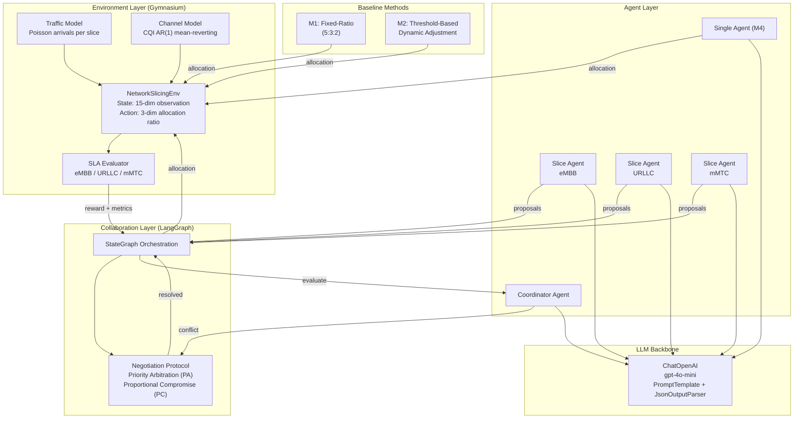
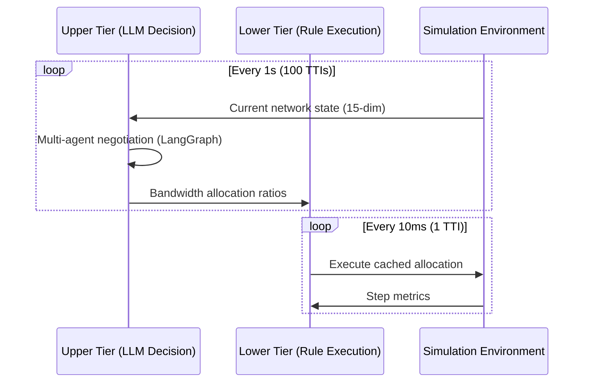
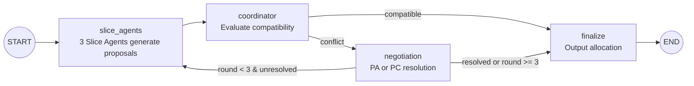

# Network Resource Management Based on Language Model Multi-Agent Systems

基于大语言模型多智能体系统的 5G 网络切片资源管理框架。

## System Architecture Design



### Two-Tier Scheduling



### Multi-Agent Negotiation Flow (LangGraph)



## Terminology and Formulas

### State Space

The environment observation is a 15-dimensional vector, consisting of 5 metrics for each of the 3 slices ($i \in \{\text{eMBB}, \text{URLLC}, \text{mMTC}\}$):

| Dimension | Symbol | Meaning | Range | Normalization |
|-----------|--------|---------|-------|---------------|
| User count | $n_i$ | Current active users per slice | $[1, N_{\max}]$ | $/\, N_{\max}$ |
| Channel quality | $\bar{c}_i$ | Average CQI per slice | $[1, 15]$ | $/\, 15$ |
| Buffer occupancy | $b_i$ | Buffer fullness per slice | $[0, 1]$ | Raw |
| Bandwidth allocation | $a_i$ | Current allocation ratio | $[0, 1]$ | Raw |
| SLA satisfaction rate | $s_i$ | Sliding window SLA rate | $[0, 1]$ | Raw |

### Action Space

Continuous allocation vector $\mathbf{a} = (a_{\text{eMBB}},\; a_{\text{URLLC}},\; a_{\text{mMTC}})$ subject to:

$$\sum_{i} a_i = 1, \quad a_i \geq 0.05$$

### Channel Quality Indicator (CQI)

CQI is a 3GPP-defined metric (integer 1--15) reported by UE to indicate downlink channel quality. Higher CQI corresponds to higher spectral efficiency $\eta(\text{CQI})$ (bits/s/Hz), allowing more data per unit bandwidth.

The simulation uses a **discrete Ornstein-Uhlenbeck (AR(1)) mean-reverting model**:

$$\text{CQI}_i(t+1) = \text{CQI}_i(t) + \alpha \big(\mu_i - \text{CQI}_i(t)\big) + \sigma \cdot \varepsilon_t, \quad \varepsilon_t \sim \mathcal{N}(0, 1)$$

where $\mu_i$ is the per-slice mean CQI, $\alpha$ is the reversion rate, and $\sigma$ is the noise standard deviation. The result is rounded to integer and clipped to $[1, 15]$.

### Throughput Model

Per-user throughput for slice $i$:

$$T_i = \frac{a_i \cdot B_{\text{total}} \cdot \eta(\text{CQI}_i) \cdot M}{n_i}$$

where $B_{\text{total}} = 100$ MHz is the total system bandwidth, $\eta(\text{CQI}_i)$ is the spectral efficiency from the 3GPP CQI table, $M = 20$ is the MIMO/coding technology multiplier, and $n_i$ is the number of active users in slice $i$.

**Weighted total throughput**:

$$T_{\text{total}} = \sum_{i} T_i \cdot n_i$$

### SLA Conditions

| Slice | Condition | Formula |
|-------|-----------|---------|
| eMBB | Average user throughput $\geq$ 50 Mbps | $T_{\text{eMBB}} \geq 50$ |
| URLLC | 99th-percentile delay $\leq$ 10% of eMBB delay | $d_{\text{URLLC}}^{p99} \leq 0.1 \cdot d_{\text{eMBB}}$ |
| mMTC | Access success rate $\geq$ 95% | $r_{\text{access}} \geq 0.95$ |

**eMBB delay** (proportional to packet weight / per-user capacity):

$$d_{\text{eMBB}} = \frac{W_{\text{eMBB}}}{T_{\text{eMBB}}}, \quad W_{\text{eMBB}} = 10$$

**URLLC 99th-percentile delay** (exponential distribution approximation):

$$d_{\text{URLLC}}^{p99} = 2.3 \cdot \frac{W_{\text{URLLC}}}{T_{\text{URLLC}}}, \quad W_{\text{URLLC}} = 0.4$$

**mMTC access rate**:

$$r_{\text{access}} = \min\!\left(1,\; \frac{a_{\text{mMTC}} \cdot B_{\text{total}} \cdot \eta(\text{CQI}_{\text{mMTC}}) \cdot \kappa}{n_{\text{mMTC}}}\right), \quad \kappa = 1.0$$

**Per-slice SLA satisfaction rate** (over a sliding window of $W = 10$ decision cycles):

$$S_i = \frac{1}{W}\sum_{t'=t-W+1}^{t} \mathbb{1}[\text{SLA}_i(t') \text{ met}]$$

### Reward Function

$$R = w_S \cdot \bar{S} + w_U \cdot U - w_V \cdot V$$

where:
- $\bar{S} = \frac{1}{3}\sum_i S_i$ is the average SLA satisfaction rate across slices
- $U = \min\!\left(1,\; \frac{\sum_i n_i \cdot \ell_i}{M \cdot B_{\text{total}}}\right)$ is the bandwidth utilization ($\ell_i$ is the per-user load demand)
- $V = 1 - \frac{1}{3}\sum_i \mathbb{1}[\text{SLA}_i \text{ met}]$ is the instantaneous SLA violation penalty
- Default weights: $w_S = 0.5$, $w_U = 0.3$, $w_V = 0.2$

### Evaluation Metrics

**Jain's Fairness Index** (based on per-slice SLA satisfaction rates):

$$J = \frac{\left(\sum_{i=1}^{n} S_i\right)^2}{n \cdot \sum_{i=1}^{n} S_i^2}, \quad n = 3$$

$J = 1$ indicates perfect fairness (all slices have equal SLA satisfaction); $J = 1/n$ indicates maximum unfairness.

**Per-decision latency**: Wall-clock time from state input to allocation output (in milliseconds).

**API call cost**: Total token consumption (input + output) per episode.

### Traffic Model

User arrivals per decision cycle follow a Poisson process:

$$n_i(t) \sim \text{Poisson}(\lambda_i)$$

Default arrival rates: $\lambda_{\text{eMBB}} = 50$, $\lambda_{\text{URLLC}} = 30$, $\lambda_{\text{mMTC}} = 20$.

**Burst scenario**: At decision cycle $t = 50$, the eMBB arrival rate doubles: $\lambda_{\text{eMBB}}' = 2\lambda_{\text{eMBB}}$.

## Comparison Methods

| ID | Method | Category | Description |
|----|--------|----------|-------------|
| M1 | Fixed-Ratio | Rule-based | Fixed allocation (eMBB:URLLC:mMTC = 5:3:2) |
| M2 | Threshold-based | Rule-based | Dynamic adjustment triggered by SLA violation |
| M4 | Single-Agent LLM | Single-agent LLM | GPT-4o-mini + CoT, no multi-agent collaboration |
| M5-PA | Multi-Agent (Priority Arbitration) | Multi-agent LLM | Slice agents + coordinator + priority-based negotiation |
| M5-PC | Multi-Agent (Proportional Compromise) | Multi-agent LLM | Slice agents + coordinator + proportional negotiation |
| M5-NoNeg | Multi-Agent (No Negotiation) | Multi-agent LLM | Slice agents + coordinator, no negotiation loop |

## Quick Start

```bash
# 1. Install dependencies
uv sync

# 2. Configure API key
cp .env.example .env
# Edit .env and fill in OPENAI_API_KEY

# 3. Run environment validation
MPLCONFIGDIR=.mplcache PYTHONPATH=. uv run python experiments/validate_env.py

# 4. Run all experiments
MPLCONFIGDIR=.mplcache PYTHONPATH=. uv run python run_all.py
```

Results are saved to `results/data/` (CSV) and `results/figures/` (PNG).
