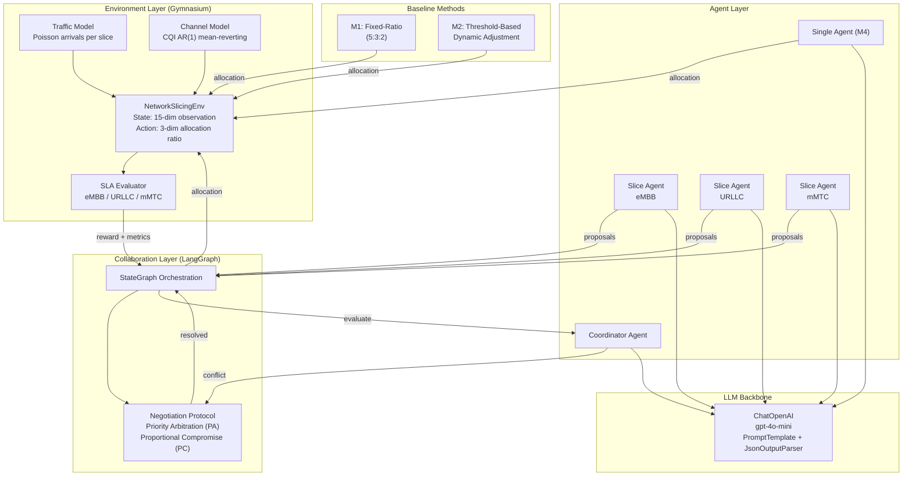
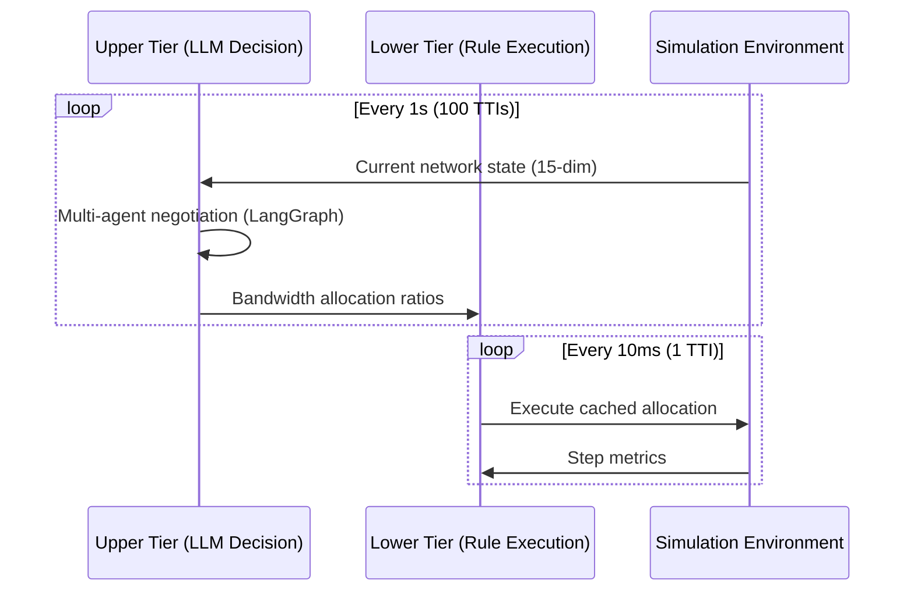
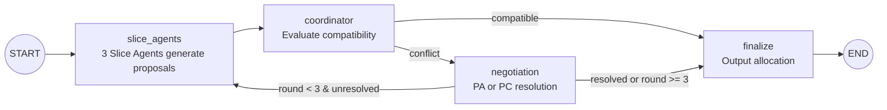

# Network Resource Management Based on Language Model Multi-Agent Systems

基于大语言模型多智能体系统的 5G 网络切片资源管理框架。

## Overview

This repository contains the simulation environment, multi-agent LLM framework, baseline methods and experiment scripts for the final-year research project *Network Resource Management Based on Language Model Multi-Agent Systems*.

The project investigates whether a structured multi-agent LLM workflow — with one slice agent per service type (eMBB / URLLC / mMTC), a coordinator, and an explicit negotiation protocol — can match or improve upon traditional rule-based heuristics and a Deep Reinforcement Learning (DRL) baseline for inter-slice bandwidth allocation in a 5G network slicing simulator. Two research questions are addressed:

- **RQ1**: How does the multi-agent LLM framework compare against fixed-ratio, threshold-based and PPO baselines on per-slice SLA satisfaction, total throughput, fairness, decision latency and token cost?
- **RQ2**: Does the explicit negotiation protocol (Priority Arbitration vs.\ Proportional Compromise) provide measurable benefits over a single-shot coordinator allocation with no negotiation?

The simulator is implemented on top of [Gymnasium](https://gymnasium.farama.org/), the LLM agents are orchestrated with [LangGraph](https://github.com/langchain-ai/langgraph) and [LangChain](https://github.com/langchain-ai/langchain), and the DRL baseline uses [Stable-Baselines3](https://stable-baselines3.readthedocs.io/) PPO.

## Repository Layout

```
Final_Project/
├── config.yaml                 # All simulation, reward, LLM and PPO hyperparameters
├── pyproject.toml              # Python project metadata and dependencies (uv / pip)
├── uv.lock                     # Locked dependency versions for reproducible installs
├── run_all.py                  # Sequential one-click runner for the full experiment pipeline
├── .env.example                # Template for OPENAI_API_KEY (copy to .env before running)
├── src/                        # Core library code (importable as `src.*`)
├── experiments/                # Experiment driver scripts (Exp1, Exp2, PPO training, aggregation)
├── visualization/              # Plot-generation utilities for the paper figures
└── results/                    # All experiment outputs (CSV, PNG, trained model)
```

The `docs/` and `paper/` directories are not part of the runnable codebase and are intentionally omitted from the description below.

### `src/` — Core Library

| Module | Contents |
|--------|----------|
| `src/environment/slicing_env.py` | `NetworkSlicingEnv` (Gymnasium): 15-dim observation, 3-dim continuous action, Poisson traffic, AR(1) CQI model, per-slice SLA evaluator and reward function. |
| `src/agents/llm_client.py` | Thin wrapper around `langchain_openai.ChatOpenAI` with retry, timeout and JSON-output parsing. |
| `src/agents/slice_agent.py` | Per-slice agent (eMBB / URLLC / mMTC) that proposes a bandwidth share with a natural-language justification. |
| `src/agents/coordinator.py` | Coordinator agent that checks proposal compatibility and decides whether to trigger negotiation or finalise. |
| `src/agents/single_agent.py` | Single-agent LLM baseline (M4) that produces the full allocation in one prompt. |
| `src/agents/multi_agent_graph.py` | LangGraph `StateGraph` orchestrating slice agents, coordinator and negotiation node. |
| `src/negotiation/protocol.py` | Two negotiation strategies: Priority Arbitration (PA) and Proportional Compromise (PC). |
| `src/baselines/fixed_ratio.py` | M1: fixed 5:3:2 allocation. |
| `src/baselines/threshold.py` | M2: rule-based dynamic adjustment triggered by SLA violation. |
| `src/baselines/ppo_policy.py` | M3: PPO policy wrapper compatible with the same evaluation loop. |
| `src/utils/metrics.py` | Per-slice SLA, weighted throughput, Jain's fairness, latency and token-counting helpers. |

### `experiments/` — Experiment Drivers

| Script | Purpose |
|--------|---------|
| `experiments/validate_env.py` | Sanity-check the simulation environment (state shape, reward range, deterministic seeding). |
| `experiments/train_ppo.py` | Train the PPO baseline; saves the model to `results/models/ppo_model.zip`. |
| `experiments/runner.py` | Shared evaluation loop, config loader and per-episode logging used by Exp1 and Exp2. |
| `experiments/exp1_performance.py` | RQ1 driver: runs a single method (M1, M2, M3-PPO, M4, M5-PA, M5-PC) under both `steady` and `burst` scenarios with 5 seeds. Can be invoked per method to enable parallel execution across terminals. |
| `experiments/exp2_negotiation.py` | RQ2 driver: runs the M5-NoNeg variant; M5-PA and M5-PC results are reused from Exp1. |
| `experiments/aggregate_results.py` | Merges per-method CSV outputs into the consolidated tables consumed by the paper. |

### `visualization/` — Figure Generation

`visualization/plot_results.py` reads the consolidated CSVs in `results/data/` and produces all figures used in the report (per-slice SLA bars, burst-trend lines, performance overviews, fairness comparison, PPO training curve).

### `results/` — Experiment Outputs

```
results/
├── data/
│   ├── per_method/             # Raw per-method per-seed step- and episode-level logs
│   ├── exp1_steps.csv          # Concatenated step-level logs for Experiment 1
│   ├── exp1_episodes.csv       # Episode-level summaries for Experiment 1
│   ├── exp1_main_table.csv     # Aggregated mean ± std table (used in §4.2 of the report)
│   ├── exp2_steps.csv          # Step-level logs for Experiment 2 (negotiation ablation)
│   ├── exp2_episodes.csv       # Episode-level summaries for Experiment 2
│   ├── exp2_comparison_table.csv  # Aggregated table for §4.3
│   └── ppo_training_curve.csv  # Episode-reward trajectory of the PPO baseline
├── figures/                    # PNG figures regenerated by `visualization/plot_results.py`
└── models/
    └── ppo_model.zip           # Trained Stable-Baselines3 PPO checkpoint
```

`config.yaml` centralises every numerical setting (bandwidth, arrival rates, CQI model parameters, reward weights, PPO hyperparameters, LLM temperature and max negotiation rounds), so all experiments are reproducible from a single source of truth.

## System Architecture Design



### Two-Tier Scheduling



### Multi-Agent Negotiation Flow (LangGraph)



## Terminology and Formulas

### State Space

The environment observation is a 15-dimensional vector, consisting of 5 metrics for each of the 3 slices ($i \in \{\text{eMBB}, \text{URLLC}, \text{mMTC}\}$):

| Dimension | Symbol | Meaning | Range | Normalization |
|-----------|--------|---------|-------|---------------|
| User count | $n_i$ | Current active users per slice | $[1, N_{\max}]$ | $/\, N_{\max}$ |
| Channel quality | $\bar{c}_i$ | Average CQI per slice | $[1, 15]$ | $/\, 15$ |
| Buffer occupancy | $b_i$ | Buffer fullness per slice | $[0, 1]$ | Raw |
| Bandwidth allocation | $a_i$ | Current allocation ratio | $[0, 1]$ | Raw |
| SLA satisfaction rate | $s_i$ | Sliding window SLA rate | $[0, 1]$ | Raw |

### Action Space

Continuous allocation vector $\mathbf{a} = (a_{\text{eMBB}},\; a_{\text{URLLC}},\; a_{\text{mMTC}})$ subject to:

$$\sum_{i} a_i = 1, \quad a_i \geq 0.05$$

### Channel Quality Indicator (CQI)

CQI is a 3GPP-defined metric (integer 1--15) reported by UE to indicate downlink channel quality. Higher CQI corresponds to higher spectral efficiency $\eta(\text{CQI})$ (bits/s/Hz), allowing more data per unit bandwidth.

The simulation uses a **discrete Ornstein-Uhlenbeck (AR(1)) mean-reverting model**:

$$\text{CQI}_i(t+1) = \text{CQI}_i(t) + \alpha \big(\mu_i - \text{CQI}_i(t)\big) + \sigma \cdot \varepsilon_t, \quad \varepsilon_t \sim \mathcal{N}(0, 1)$$

where $\mu_i$ is the per-slice mean CQI, $\alpha$ is the reversion rate, and $\sigma$ is the noise standard deviation. The result is rounded to integer and clipped to $[1, 15]$.

### Throughput Model

Per-user throughput for slice $i$:

$$T_i = \frac{a_i \cdot B_{\text{total}} \cdot \eta(\text{CQI}_i) \cdot M}{n_i}$$

where $B_{\text{total}} = 100$ MHz is the total system bandwidth, $\eta(\text{CQI}_i)$ is the spectral efficiency from the 3GPP CQI table, $M = 20$ is the MIMO/coding technology multiplier, and $n_i$ is the number of active users in slice $i$.

**Weighted total throughput**:

$$T_{\text{total}} = \sum_{i} T_i \cdot n_i$$

### SLA Conditions

| Slice | Condition | Formula |
|-------|-----------|---------|
| eMBB | Average user throughput $\geq$ 50 Mbps | $T_{\text{eMBB}} \geq 50$ |
| URLLC | 99th-percentile delay $\leq$ 10% of eMBB delay | $d_{\text{URLLC}}^{p99} \leq 0.1 \cdot d_{\text{eMBB}}$ |
| mMTC | Access success rate $\geq$ 95% | $r_{\text{access}} \geq 0.95$ |

**eMBB delay** (proportional to packet weight / per-user capacity):

$$d_{\text{eMBB}} = \frac{W_{\text{eMBB}}}{T_{\text{eMBB}}}, \quad W_{\text{eMBB}} = 10$$

**URLLC 99th-percentile delay** (exponential distribution approximation):

$$d_{\text{URLLC}}^{p99} = 2.3 \cdot \frac{W_{\text{URLLC}}}{T_{\text{URLLC}}}, \quad W_{\text{URLLC}} = 0.4$$

**mMTC access rate**:

$$r_{\text{access}} = \min\!\left(1,\; \frac{a_{\text{mMTC}} \cdot B_{\text{total}} \cdot \eta(\text{CQI}_{\text{mMTC}}) \cdot \kappa}{n_{\text{mMTC}}}\right), \quad \kappa = 1.0$$

**Per-slice SLA satisfaction rate** (over a sliding window of $W = 10$ decision cycles):

$$S_i = \frac{1}{W}\sum_{t'=t-W+1}^{t} \mathbb{1}[\text{SLA}_i(t') \text{ met}]$$

### Reward Function

$$R = w_S \cdot \bar{S} + w_U \cdot U - w_V \cdot V$$

where:
- $\bar{S} = \frac{1}{3}\sum_i S_i$ is the average SLA satisfaction rate across slices
- $U = \min\!\left(1,\; \frac{\sum_i n_i \cdot \ell_i}{M \cdot B_{\text{total}}}\right)$ is the bandwidth utilization ($\ell_i$ is the per-user load demand)
- $V = 1 - \frac{1}{3}\sum_i \mathbb{1}[\text{SLA}_i \text{ met}]$ is the instantaneous SLA violation penalty
- Default weights: $w_S = 0.5$, $w_U = 0.3$, $w_V = 0.2$

### Evaluation Metrics

**Jain's Fairness Index** (based on per-slice SLA satisfaction rates):

$$J = \frac{\left(\sum_{i=1}^{n} S_i\right)^2}{n \cdot \sum_{i=1}^{n} S_i^2}, \quad n = 3$$

$J = 1$ indicates perfect fairness (all slices have equal SLA satisfaction); $J = 1/n$ indicates maximum unfairness.

**Per-decision latency**: Wall-clock time from state input to allocation output (in milliseconds).

**API call cost**: Total token consumption (input + output) per episode.

### Traffic Model

User arrivals per decision cycle follow a Poisson process:

$$n_i(t) \sim \text{Poisson}(\lambda_i)$$

Default arrival rates: $\lambda_{\text{eMBB}} = 50$, $\lambda_{\text{URLLC}} = 30$, $\lambda_{\text{mMTC}} = 20$.

**Burst scenario**: At decision cycle $t = 50$, the eMBB arrival rate doubles: $\lambda_{\text{eMBB}}' = 2\lambda_{\text{eMBB}}$.

## Comparison Methods

| ID | Method | Category | Description |
|----|--------|----------|-------------|
| M1 | Fixed-Ratio | Rule-based | Fixed allocation (eMBB:URLLC:mMTC = 5:3:2) |
| M2 | Threshold-based | Rule-based | Dynamic adjustment triggered by SLA violation |
| M3 | PPO | Deep RL | Stable-Baselines3 PPO trained on the same environment |
| M4 | Single-Agent LLM | Single-agent LLM | GPT-4o-mini + CoT, no multi-agent collaboration |
| M5-PA | Multi-Agent (Priority Arbitration) | Multi-agent LLM | Slice agents + coordinator + priority-based negotiation |
| M5-PC | Multi-Agent (Proportional Compromise) | Multi-agent LLM | Slice agents + coordinator + proportional negotiation |
| M5-NoNeg | Multi-Agent (No Negotiation) | Multi-agent LLM | Slice agents + coordinator, no negotiation loop |

## Quick Start

### 1. Install dependencies

The project is managed with [`uv`](https://github.com/astral-sh/uv); a standard `pip install -e .` against `pyproject.toml` also works.

```bash
uv sync
```

### 2. Configure the API key

```bash
cp .env.example .env
# Edit .env and fill in OPENAI_API_KEY (only required for M4 / M5 variants)
```

### 3. Validate the environment

```bash
MPLCONFIGDIR=.mplcache PYTHONPATH=. uv run python experiments/validate_env.py
```

### 4. Run the full pipeline (sequential)

```bash
MPLCONFIGDIR=.mplcache PYTHONPATH=. uv run python run_all.py
```

This trains PPO (if `results/models/ppo_model.zip` is missing), runs every method on both scenarios with 5 seeds, aggregates the CSVs and regenerates all figures.

### 5. Recommended parallel workflow

For faster turnaround, methods can be launched in separate terminals because each writes to its own `results/data/per_method/` directory:

```bash
# Terminal 0 (only needed once)
MPLCONFIGDIR=.mplcache PYTHONPATH=. uv run python -m experiments.train_ppo

# Terminals 1-6 (one method each, in parallel)
MPLCONFIGDIR=.mplcache PYTHONPATH=. uv run python -m experiments.exp1_performance M1-Fixed
MPLCONFIGDIR=.mplcache PYTHONPATH=. uv run python -m experiments.exp1_performance M2-Threshold
MPLCONFIGDIR=.mplcache PYTHONPATH=. uv run python -m experiments.exp1_performance M3-PPO
MPLCONFIGDIR=.mplcache PYTHONPATH=. uv run python -m experiments.exp1_performance M4-SingleLLM
MPLCONFIGDIR=.mplcache PYTHONPATH=. uv run python -m experiments.exp1_performance M5-PA
MPLCONFIGDIR=.mplcache PYTHONPATH=. uv run python -m experiments.exp1_performance M5-PC

# Terminal 7 (negotiation ablation)
MPLCONFIGDIR=.mplcache PYTHONPATH=. uv run python -m experiments.exp2_negotiation M5-NoNeg

# After all methods finish: aggregate and plot
MPLCONFIGDIR=.mplcache PYTHONPATH=. uv run python -m experiments.aggregate_results
MPLCONFIGDIR=.mplcache PYTHONPATH=. uv run python -m visualization.plot_results
```

Final tables are saved as CSV in `results/data/`, figures in `results/figures/`, and the trained PPO checkpoint in `results/models/`.
